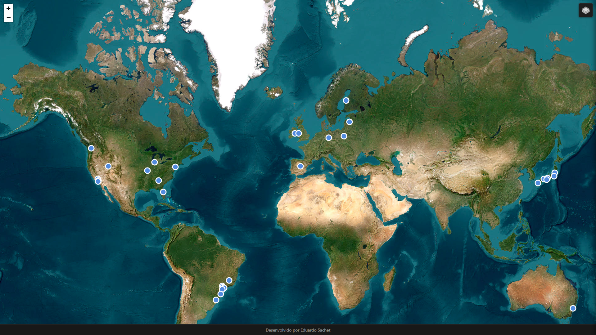

# 🗺️ DriftTrackers

**DriftTrackers** is an interactive, front-end web application that allows users to explore iconic drift tracks from around the world. This project provides a detailed map interface to discover locations, view track details, and see recent event winners from top-tier championships like Formula Drift, Drift Masters, and D1GP.

This project is built with 100% vanilla **HTML5**, **CSS3**, and **JavaScript (ES6+)**, with no backend or build steps required.



---

## ✨ Features

* **Interactive Global Map:** Built with **Leaflet.js** for a fast and smooth user experience.
* **24+ Iconic Tracks:** Features a curated list of legendary tracks from the USA, Japan, and Europe.
* **Detailed Info Panel:** Click any track icon to open a slide-in panel displaying:
    * Track photo
    * Description and history
    * Last major event
    * Recent event winner
* **Advanced Layer Control:** Instantly switch between three distinct map views:
    * **Dark Mode** (Default)
    * **Satellite** (For high-detail viewing of the track layout)
    * **Light Mode**
* **Stable SVG Icons:** Custom SVG icons that stay perfectly anchored and crisp, even at maximum zoom.
* **Optimized Zoom:** The map is capped at `maxZoom: 20` to prevent "data not available" errors and ensure a seamless browsing experience.
* **Pure Front-End:** Runs entirely in the browser.

## 💻 Tech Stack

* **HTML5** (Semantic Structure)
* **CSS3** (Dark Mode Theme, Animations, & Styling)
* **JavaScript (ES6+)** (DOM Manipulation, Event Handling, Data Management)
* **[Leaflet.js](https://leafletjs.com/)** (Core interactive map library)
* **Tile Providers:**
    * **Stadia Maps** (Alidade Smooth Dark)
    * **ESRI** (World Imagery - Satellite)
    * **OpenStreetMap** (Standard Light Map)

## 🚀 How to Use

This project requires no installation or build process.

1.  **Clone the repository:**
    ```sh
    git clone [https://github.com/YourUsername/DriftTrackers.git](https://github.com/YourUsername/DriftTrackers.git)
    ```
2.  **Navigate to the project directory:**
    ```sh
    cd DriftTrackers
    ```
3.  **Open the `index.html` file in your favorite browser.**

That's it! You are now running DriftTrackers.

## 📄 License

This project is licensed under the MIT License. See the `LICENSE` file for details.

---

Developed by **Eduardo Sachet**
